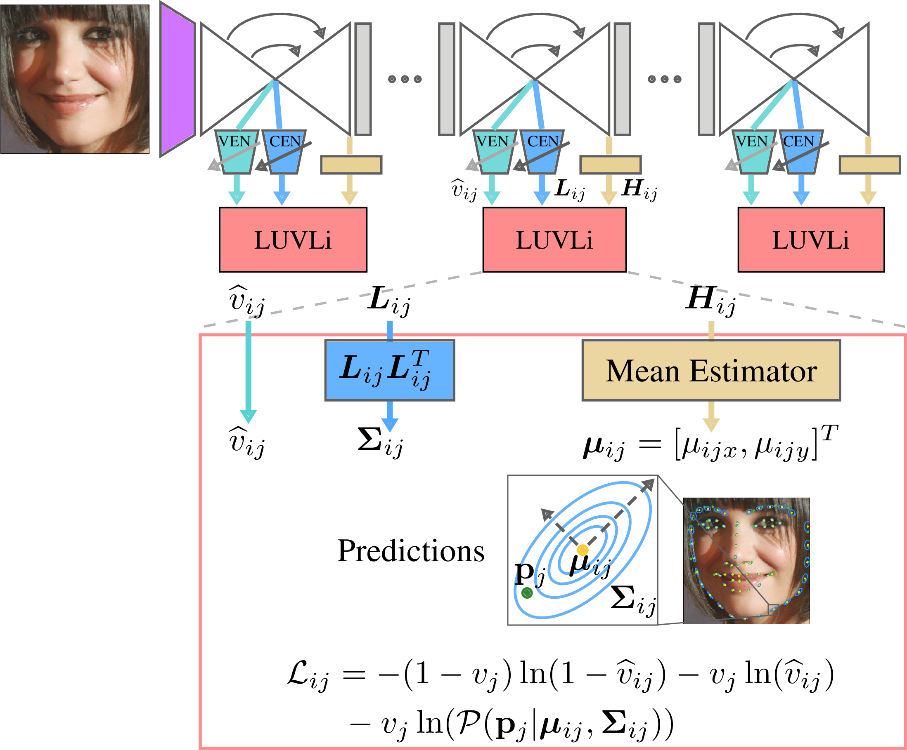

<!--
Copyright (C) 2017-2023 Mitsubishi Electric Research Laboratories (MERL)

SPDX-License-Identifier: AGPL-3.0-or-later
-->

# [LUVLi Face Alignment: Estimating Landmarks' Location, Uncertainty, and Visibility Likelihood](https://arxiv.org/pdf/2004.02980.pdf)

### [1min_talk](https://www.youtube.com/watch?v=-TgQdy4wz2o)


[Abhinav Kumar](https://sites.google.com/view/abhinavkumar/)<sup>*1,4</sup>, 
[Tim K. Marks](https://www.merl.com/people/tmarks)<sup>*2</sup>, 
[Wenxuan Mou](https://scholar.google.co.in/citations?user=qWSFJqcAAAAJ&hl=en&oi=ao)<sup>*3</sup>, 
[Ye Wang](https://www.merl.com/people/yewang)<sup>2</sup>,
[Michael Jones](https://www.merl.com/people/mjones)<sup>2</sup>, 
[Anoop Cherian](https://www.merl.com/people/cherian)<sup>2</sup>, 
[Toshiaki Koike-Akino](https://www.merl.com/people/koike)<sup>2</sup>, 
[Xiaoming Liu](http://www.cse.msu.edu/~liuxm/index2.html)<sup>4</sup>,
[Chen Feng](https://ai4ce.github.io/)<sup>5</sup><br>
<sup>1</sup>University of Utah, <sup>2</sup>MERL, <sup>3</sup>University of Manchester, <sup>4</sup>Michigan State University, <sup>5</sup>New York University

in [CVPR 2020](http://cvpr2020.thecvf.com/).

  

> Modern face alignment methods have become quite accurate at predicting the locations of facial landmarks, but they do not typically estimate the uncertainty of their predicted locations nor predict whether landmarks are visible. In this paper, we present a novel framework for jointly predicting landmark locations, associated uncertainties of these predicted locations, and landmark visibilities. We model these as mixed random variables and estimate them using a deep network trained with our proposed Location, Uncertainty, and Visibility Likelihood (LUVLi) loss. In addition, we release an entirely new labeling of a large face alignment dataset with over 19,000 face images in a full range of head poses. Each face is manually labeled with the ground-truth locations of 68 landmarks, with the additional information of whether each landmark is unoccluded, self-occluded (due to extreme head poses), or externally occluded. Not only does our joint estimation yield accurate estimates of the uncertainty of predicted landmark locations, but it also yields state-of-the-art estimates for the landmark locations themselves on multiple standard face alignment datasets. Our method’s estimates of the uncertainty of predicted landmark locations could be used to automatically identify input images on which face alignment fails, which can be critical for downstream tasks.

Much of the codebase is based on [DU-Net](https://github.com/zhiqiangdon/CU-Net).

[](https://arxiv.org/pdf/2004.02980.pdf)

### [UGLLI Face Alignment: Estimating Uncertainty with Gaussian Log-Likelihood Loss](http://www.merl.com/publications/docs/TR2019-117.pdf#page=3)
[News](https://www.merl.com/news/award-20191027-1293) | [Best Oral Presentation Award](https://www.merl.com/public/img/news/photo-1293.jpg)

[Abhinav Kumar](https://sites.google.com/view/abhinavkumar/)<sup>*1,4</sup>, 
[Tim K. Marks](https://www.merl.com/people/tmarks)<sup>*2</sup>, 
[Wenxuan Mou](https://scholar.google.co.in/citations?user=qWSFJqcAAAAJ&hl=en&oi=ao)<sup>*3</sup>, 
[Chen Feng](https://ai4ce.github.io/)<sup>5</sup>
[Xiaoming Liu](http://www.cse.msu.edu/~liuxm/index2.html)<sup>4</sup>,

in [ICCV 2019](https://iccv2019.thecvf.com/) Workshops on Statistical Deep Learning in Computer Vision.


## Citation

If you find our work useful in your research, please consider starring the repo and citing the following papers:

```Bibtex
@inproceedings{kumar2020luvli,
  title={LUVLi Face Alignment: Estimating Landmarks' Location, Uncertainty, and Visibility Likelihood},
  author={Kumar, Abhinav and Marks, Tim K. and Mou, Wenxuan and Wang, Ye and Jones, Michael and Cherian, Anoop and Koike-Akino, Toshiaki and Liu, Xiaoming and Feng, Chen},
  booktitle={IEEE/CVF Conference on Computer Vision and Pattern Recognition (CVPR)},
  year={2020}
}

@inproceedings{kumar2019uglli,
  title={UGLLI Face Alignment: Estimating Uncertainty with Gaussian Log-Likelihood Loss},
  author={Kumar, Abhinav and Marks, Tim K and Mou, Wenxuan and Feng, Chen and Liu, Xiaoming},
  booktitle={ICCV Workshops on Statistical Deep Learning in Computer Vision},
  year={2019}
}
```

## Setup

- **Requirements**

    1. Python 2.7
    2. [PyTorch](http://pytorch.org) 0.3.0 or 0.3.1
    3. Torchvision 0.2.0
    4. Cuda 8.0
    5. Ubuntu 18.04

    Other platforms have not been tested.

- **Installation**

    Clone the repo first. Unless otherwise stated the scripts and instructions assume working directory is the project root. There are two ways to run this repo - through Conda or through pip.

    ##### Conda install
    Install conda first and then install the desired packages:
    ```bash
    wget https://repo.anaconda.com/archive/Anaconda3-2020.02-Linux-x86_64.sh
    bash Anaconda3-2020.02-Linux-x86_64.sh
    source ~/.bashrc
    conda list
    conda env create --file conda_py27.yml
    conda activate LUVLi
    ```
    
    ##### Pip install
    
    ```bash
    virtualenv --python=/usr/bin/python2.7 LUVLi
    source LUVLi/bin/activate
    pip install torch==0.3.1 -f https://download.pytorch.org/whl/cu80/stable
    pip install torchvision==0.2.0 sklearn opencv-python 
    sudo apt-get install libfreetype6-dev build-essential autoconf libtool pkg-config python-opengl python-imaging python-pyrex python-pyside.qtopengl idle-python2.7 qt4-dev-tools qt4-designer libqtgui4 libqtcore4 libqt4-xml libqt4-test libqt4-script libqt4-network libqt4-dbus python-qt4 python-qt4-gl libgle3 python-dev
    pip install configparser seaborn
    ```


- **Directory structure**

    We need to make some extra directories to store the datasets and the models
    ```bash
    cd $PROJECT_DIR
    
    # This directory stores the models of the training in its sub-directories
    mkdir abhinav_model_dir
    
    # For storing train datasets
    mkdir -p bigdata1/zt53/data/face
    
    # For storing csv
    mkdir dataset_csv
    ```

- **Datasets**

    We use the following face datasets for training and testing:
    
    1. [AFW](https://ibug.doc.ic.ac.uk/download/annotations/afw.zip) 
    2. [HELEN](https://ibug.doc.ic.ac.uk/download/annotations/helen.zip)
    3. [IBUG](https://ibug.doc.ic.ac.uk/download/annotations/ibug.zip)
    4. [LFPW](https://ibug.doc.ic.ac.uk/download/annotations/lfpw.zip)
    5. [300W Cropped indoor and outdoor](https://ibug.doc.ic.ac.uk/resources/facial-point-annotations/) - available in 4 parts
    6. [Menpo](https://www.dropbox.com/s/o3615gx23xohs00/menpo_challenge_trainset.zip)
    7. [COFW-Color](http://www.vision.caltech.edu/xpburgos/ICCV13/Data/COFW_color.zip)
    8. [Multi-PIE](https://www.flintbox.com/public/project/4742/)
    9. [300W_LP](https://drive.google.com/file/d/0B7OEHD3T4eCkVGs0TkhUWFN6N1k/view?usp=sharing)
    10. [AFLW-19](https://www.tugraz.at/institute/icg/research/team-bischof/learning-recognition-surveillance/downloads/aflw) Drop an email to LRS group to get the dataset mailed to you
    11. [WFLW-98](https://drive.google.com/uc?id=1hzBd48JIdWTJSsATBEB_eFVvPL1bx6UC&export=download)
    12. [MERL-RAV](https://github.com/abhi1kumar/MERL-RAV_dataset) (We refer to MERL-RAV as AFLW_ours in this repo) 
    
    Extract and move all the datasets to the ```bigdata1/zt53/data/face``` directory. Follow the [MERL-RAV dataset instructions](https://github.com/abhi1kumar/MERL-RAV_dataset#instructions) to get the ```merl_rav_organized``` directory.
    

- **Extra files**

   Next download the [HR-Net](https://github.com/HRNet/HRNet-Facial-Landmark-Detection) processed annotations of AFLW and WFLW dataset from [one-drive](https://1drv.ms/u/s!AiWjZ1LamlxzdmYbSkHpPYhI8Ms). Extract and move them to the ```dataset_csv``` directory. Then, type the following:
    
    ```bash
    chmod +x *.sh
    ./scripts_dataset_splits_preparation.sh
    ```
  
    We also use the [DU-Net](https://github.com/zhiqiangdon/CU-Net) 300-W Split 1 heatmap model for finetuning 300-W Split 1 and 2 models. Please contact [Zhiqiang Tang](https://sites.google.com/site/zhiqiangtanghomepage) to get this. Copy this file to the project directory:
    ```bash
    cp face-layer-num-8-order-1-model-best.pth.tar $PROJECT_DIR
    ```

    The directory structure should look like this:
    ```bash
    
    LUVLi
    ├── abhinav_model_dir
    │
    ├── bigdata1
    │      └── zt53
    │             └── data
    │                    └── face
    │                           ├── 300W
    │                           │      ├── 01_Indoor
    │                           │      └── 02_Outdoor
    │                           ├── 300W_LP
    │                           ├── aflw
    │                           │      └──flickr
    │                           │            ├── 0
    │                           │            ├── 1
    │                           │            └── 2
    │                           ├── afw
    │                           ├── COFW_color
    │                           │      └── COFW_test_color.mat
    │                           ├── helen
    │                           ├── ibug
    │                           ├── lfpw
    │                           ├── menpo
    │                           ├── merl_rav_organized
    │                           ├── Multi-PIE_original_data
    │                           └── wflw
    │
    ├── Bounding\ Boxes
    ├── data
    ├── dataset
    │
    ├── dataset_csv
    │      ├── aflw
    │      │      ├── face_landmarks_aflw_test.csv
    │      │      ├── face_landmarks_aflw_test_frontal.csv
    │      │      └── face_landmarks_aflw_train.csv
    │      └── wflw
    │             ├── face_landmarks_wflw_test.csv
    │             ├── face_landmarks_wflw_test_blur.csv
    │             ├── face_landmarks_wflw_test_expression.csv
    │             ├── face_landmarks_wflw_test_illumination.csv
    │             ├── face_landmarks_wflw_test_largepose.csv
    │             ├── face_landmarks_wflw_test_makeup.csv
    │             ├── face_landmarks_wflw_test_occlusion.csv
    │             └── face_landmarks_wflw_train.csv
    │
    ├── images
    ├── models
    ├── options
    ├── plot
    ├── pylib
    ├── splits_prep
    ├── test
    ├── utils
    │
    ├── face-layer-num-8-order-1-model-best.pth.tar
    │ ...
    ```
    
    The splits are made as follows:
    
    | Splits | Name                 | Datasets |
    |--------|--------------------- |----------| 
    | 1      | 300-W Split 1        | 1-4|
    | 2      | 300-W Split 2        | 1-9|
    | 3      | AFLW-19              | 10 |
    | 4      | WFLW                 | 11 |
    | 5      | MERL-RAV (AFLW_ours) | 12 |
    

## Training

Train the model:
```bash
chmod +x scripts_training.sh
./scripts_training.sh
```

## Testing Pre-trained Models
Our pre-trained models are available on Zenodo.org at the link <a href="https://zenodo.org/records/10870538">here</a>. 

### Model Zoo

| Split | Name                 | Directory |  LUVLi                | UGLLI                 |
|-------|--------------------- |-----------|-----------------------|-----------------------|
| 1     | 300-W Split 1        | run_108   | lr-0.00002-49.pth.tar | - |
| 2     | 300-W Split 2        | run_109   | lr-0.00002-49.pth.tar | - |
| 3     | AFLW-19              | run_507   | lr-0.00002-49.pth.tar | - |
| 4     | WFLW                 | run_1005  | lr-0.00002-49.pth.tar |- |
| 5     | MERL-RAV (AFLW_ours) | run_5004  | lr-0.00002-49.pth.tar |- |
| 1     | 300-W Split 1        | run_924   | -                     |  lr-0.00002-39.pth.tar |
| 2     | 300-W Split 2        | run_940   | -                     |  lr-0.00002-39.pth.tar |

### Testing

Download and unzip the zip file from Zenodo to extract pre-trained models to the ```abhinav_model_dir``` first. The directory structure should look like this:

```bash
LUVLi
├── abhinav_model_dir
│      ├── run_108
│      │       └── lr-0.00002-49.pth.tar
│      │
│      ├── run_109
│      │       └── lr-0.00002-49.pth.tar
│      │
│      ├── run_507
│      │       └── lr-0.00002-49.pth.tar
│      │
│      ├── run_1005
│      │       └── lr-0.00002-49.pth.tar
│      │
│      └──  run_5004
│               └── lr-0.00002-49.pth.tar
│  ...

```

Next type the following:

```bash
chmod +x scripts_evaluation.sh
./scripts_evaluation.sh
```


### Qualitative Plots/Visualization

In case you want to get our qualitative plots and also the transformed figures, type:
```bash
python plot/show_300W_images_overlaid_with_uncertainties.py --exp_id abhinav_model_dir/run_109_evaluate/ --laplacian
python plot/plot_uncertainties_in_transformed_space.py          -i run_109_evaluate/300W_test --laplacian
python plot/plot_residual_covariance_vs_predicted_covariance.py -i run_109_evaluate --laplacian
python plot/plot_histogram_smallest_eigen_value.py              -i run_109_evaluate --laplacian
```

## FAQs

#### Training options

| Options                             |  Command                          |
|-------------------------------------|-----------------------------------|
| UGLLI                               | Default                           |
| LUVLi                               |```--laplacian --use_visibility``` |
| Post processing by ReLU             | ```--pp "relu"```                 |
| Aug scheme of Bulat et al, ICCV 2017| ```--bulat_aug```                 |
| Use slurm                           | ```--slurm```                     |

#### Preparing JSONs
Images of splits are assumed to be in different directories with images and landmarks groundtruth of the same name with pts/mat extension. The bounding box ground truth for the first four face datasets is a mat file. The bounding boxes for other datasets is calculated by adding 5% noise to the tightest bounding box.

Go to the ```splits_prep``` directory and open ```config.txt```. 
```bash
input_folder_path    = ./bigdata1/zt53/data/face/          #the base path of all the images in the folder
annotations_path     = ./Bounding Boxes/                   #the bounding box groundtruths are in this folder 
num_keypoints        = 68                                  # assumed to be constant for a particular split

train_datasets_names = lfpw, helen, afw                    #train datasets name
train_folders        = lfpw/trainset, helen/trainset, afw  #folders path relative to input_folder_path
train_annotations    = bounding_boxes_lfpw_trainset.mat, bounding_boxes_helen_trainset.mat, bounding_boxes_afw.mat #paths relative to annotations_path

val_datasets_names   = lfpw, helen, ibug	               # val datasets name
val_folders          = lfpw/testset, helen/testset, ibug   #folders path relative to input_folder_path
val_annotations      = bounding_boxes_lfpw_testset.mat, bounding_boxes_helen_testset.mat, bounding_boxes_ibug.mat #paths relative to annotations_path

output_folder        = ./dataset                           # folder in which JSONs is to be stored
output_prefix        = normal_                             # prefix of the JSONs
```

We have **already placed** the bounding box initializations and the annotations of the train images of 300W dataset in the ```Bounding Box``` directory. In case, you are wondering the source of these annotations, you too can downloaded this from [here](https://ibug.doc.ic.ac.uk/media/uploads/competitions/bounding_boxes.zip).

#### Get 300-W Split 1 JSON
```bash
python splits_prep/get_jsons_from_config.py -i splits_prep/config.txt
```

#### Get 300-W Split 2 JSON
```bash
python splits_prep/get_jsons_from_config.py -i splits_prep/config_split2.txt
```

#### Get Menpo and Multi-PIE JSONs
```bash
python splits_prep/get_jsons_from_config.py -i splits_prep/config_menpo.txt
python splits_prep/get_jsons_from_config.py -i splits_prep/config_multi_pie.txt
```

## Acknowledgements

We thank the authors of the [DU-Net](https://github.com/zhiqiangdon/CU-Net) for their awesome codebase. Please also consider citing them.

## Contact

Feel free to open an issue here or drop an email to this address -
Abhinav Kumar ```(abhinav3663@gmail.com)``` or Tim K. Marks ```(tmarks@merl.com)```.

## Contributing
See [CONTRIBUTING.md](CONTRIBUTING.md) for our policy on contributions.

# License
Released under `AGPL-3.0-or-later` license, as found in the [LICENSE.md](LICENSE.md) file.

All files, except as listed below:
```
Copyright (c) 2017-2023 Mitsubishi Electric Research Laboratories (MERL)

SPDX-License-Identifier: AGPL-3.0-or-later
```

- The [DU-Net](https://github.com/zhiqiangdon/CU-Net) files carry `Apache-2.0 License` as found in [Apache-2.0 License](LICENSES/Apache-2.0.md).
  ```
  Copyright (c) 2017-2023 Mitsubishi Electric Research Laboratories (MERL)
  Copyright (c) Xi Peng, May 2017
  
  SPDX-License-Identifier: AGPL-3.0-or-later
  SPDX-License-Identifier: Apache-2.0
  ```

- `utils/visualizer.py` and `utils/html.py` files carry `BSD-2-Clause` as found in [BSD-2-Clause.md](LICENSES/BSD-2-Clause.md).
  ```
  Copyright (c) 2019-2023 Mitsubishi Electric Research Laboratories (MERL)
  Copyright (c) 2017, Jun-Yan Zhu and Taesung Park 
  
  SPDX-License-Identifier: AGPL-3.0-or-later
  SPDX-License-Identifier: BSD-2-Clause
  ```

- `models/spatial_transformer_network.py` files carries `BSD-3-Clause` as found in [BSD-3-Clause.md](LICENSES/BSD-3-Clause.md).
  ```
  Copyright (c) 2019-2023 Mitsubishi Electric Research Laboratories (MERL)
  Copyright (c) 2017 Ghassen Hamroun 
  
  SPDX-License-Identifier: AGPL-3.0-or-later
  SPDX-License-Identifier: BSD-3-Clause
  ```

- `utils/logger.py` file carries `MIT License` as found in [MIT.md](LICENSES/MIT.md).
  ```
  Copyright (c) 2017-2023 Mitsubishi Electric Research Laboratories (MERL)
  Copyright (c) Wei YANG 2017
  
  SPDX-License-Identifier: AGPL-3.0-or-later
  SPDX-License-Identifier: MIT
  ```
